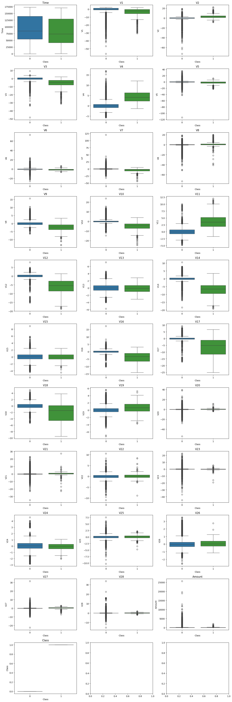
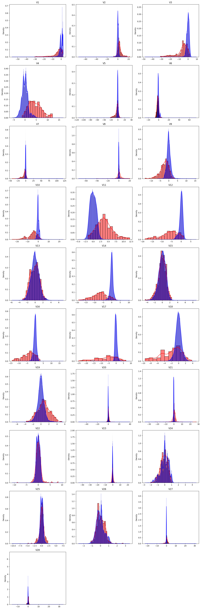
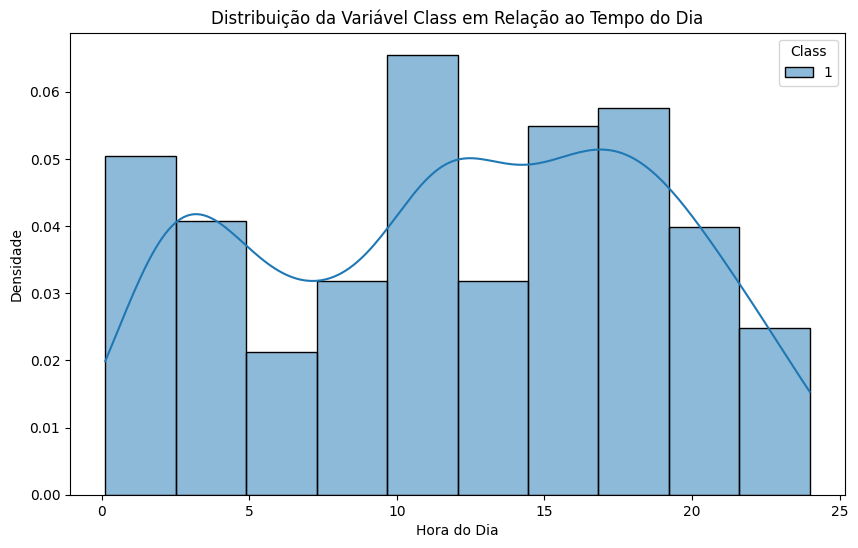
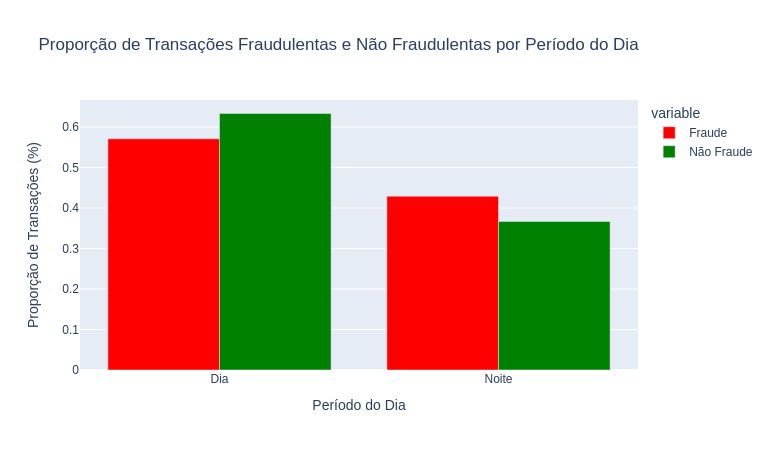

# Fraude de Crédito

## 💼 Contexto:
Sabe-se que milhões de transações de crédito são feitas diariamente, sendo apenas algumas delas são fraudulentas.As fraudes, apesar de sua ocorrência relativamente baixa, podem gerar prejuízos enormes para as instituições financeiras. 

Essa problemática pode ser resolvida utilizando modelos de aprendizado de máquina. Esses modelos conseguem, a partir de informações específicas de cada transação, prever se a transação será fraudulenta ou não. 

É importante destacar que a tarefa de prever fraudes é desafiadora devido à natureza altamente desbalanceada da base de dados.


## 📊 Análise Exploratória de Dados

### Visão geral do DataSet

O dataset utilizado contém cerca de 30 variáveis sendo 28 vindas de um processo de PCA ( devido a questões de LGPD) e as outras 2 são variáveis ‘Time’ (horário da transação) e ‘Amount’ (montante da transação). 

Em um primeiro momento foi feita uma análise exploratória nos dados, a fim de tratar-los e retirar possíveis insights.  

Foi feita a verificação e retirada de valos nulos/duplicados, depois foi feita uma análise sobre a frequência das classes. Como esperado, os dados são extremamente desbalanceados contendo 99,83% de dados não fraudulentos e 0,17% de dados fraudulentos. 


Ao analisar a estatística distributiva dos dados, notou-se uma grande presença de outliers em ambas as classes. Além disso, verificou que algumas variáveis possuíam diferentes médias e medianas para as classes, fato que ajudaria  na classificação das fraudes.

### Análise de Outliers

Verificando o gráfico de boxplot das variáveis independentes em relação as suas classes, notou-se que praticamente todas variáveis para ambas as classes possuía fortes outliers.  



Sabe-se que os outliers podem atrapalhar a estimativa dos coeficientes das variáveis para estimação da variável target. Diante dessa problemática foi cogitado a retirada dos outliers por meio do cálculo do Inter Quartile Range ( IQR ). Entretanto, verificou que cerca de 458 de 473 classes fraudulentas possuiam outliers. Dessa maneira foi descartada a ideia de retirar os outliers. Devemos escolher algum modelo que consiga lidar bem com eles... 

### Análise na Distribuição das Variáveis:

Após verificar que algumas medidas de centralidade entre as classes se diferenciavam é essencial fazer análise da distribuição das variáveis. Dessa forma podemos aplicar algum feature engineer e utilizar apenas as variáveis que mais representam a classe fraudulenta. 




Verificando a distribuição das variáveis entre suas classes nota-se que:  

(i) V3, V4, V7, V9, V10, V11, V12, V14 e V16, parecem ter distribuições bem diferente. 

(ii) V1, V2, V5, V8, V17, V18, V19 e V21 parecem ter distribuições pouco diferente. 

(iii) V6, V13, V15, V20, V22, V23, V24, V25, V26, V27 e V28 parecem ter distribuições iguais. 

Apenas a análise visual entre as classes das variáveis não seria suficiente para dizer se há diferença significativa entre as distribuições. Para isso foi utilizado os teste paramétricos e não paramétricos, T-test e U-test, respectivamente. 

O resultados dos testes de hipóteses foi: 

T-Test indicou que as variáveis: V13, V15, V22, V23, V25, V26 possuem distribuições iguais  

U-Test indicou que as variáveis: V13, V15, V22 e V25 

Sugere-se então que essas variáveis sejam retiradas a fim de melhorarmos a performance do modelo. 


### Análise de Correlação

Foi feita também uma análise de correlação das variáveis com o alvo. Nota-se que as variáveis que não rejeitaram Ho do testes T  e U  ( ou seja, possui distribuições entre as classes iguais) possuiram uma baixa correlação com a variável dependente (alvo).

### Análise Variável Time 

A variável 'Time' é diferença de tempo em segundos a partir da primeira transação. Ao transformar os valores em horas, verificou-se que o último dado do dataset possuia um Time de 48. Diante disso, nota-se que nosso dataset possui 2 dias de transações de crédito. 




Foi feito um plot do seu histograma com seu kde buscando verificar se havia algum padrão para o horário de fraudes. Entretanto, a distribuição mostrou-se sem um padrão definido. Ainda sim, foi feita uma análise para verificar a proporção de fraudes durante o dia e a noite e também não mostrou nenhum padrão significativo.



### Feature Engineer

Devido à falta de informações das variáveis foi utilizado a  correlação(Pearson) e teste de hipóteses(T-test e U-test) para extrair as variáveis que mais ajudassem a prever as classes fradulentas... Conseguimos melhorar o f1-score do modelo em 1%.


### Modelo de Aprendizado de Máquina

O modelo utilizado foi de Random Forest no seu padrão default do sklearn. Esse é um modelo de ensemble que permite lidar bem com base de dados desbalanceada que contém um grande número de outliers. 


### Resultado
O modelo de Random Forest permitiu um F1-Score de 90% com a seleção de variáveis utilizando Correlação de Pearson e otimização do f1-score por meio do threshold de decisão. 

Dessa maneira o modelo conseguiu prever cerca de  80 fraudes de 95. Além disso, apenas “pertubou” 2 clientes que foram os únicos falsos positivos. 


## Contato
bernardo.alemar@hotmail.com

# Executar o Script em sua máquina local
## Pré-requisitos:

Antes de começar, certifique-se de ter o seguinte instalado em sua máquina:

- Python 3.10.12
- pip (gerenciador de pacotes Python)
- Git (ferramenta de controle de versão)

Uma vez que você tenha isso instalado, abra um terminal em sua máquina local e execute os seguintes comandos:

1. **Clone o repositório:**
   ```bash
   git clone https://github.com/bAlemar/Fraud-Detection.git

2. **Navegue até o diretório do repositório clonado:**
   ```bash
   cd Fraud-Detection

3. **Crie um ambiente virtual:**
   ```bash
    python -m venv ambiente_virtual

4. **Ative o ambiente virtual:**

   **4.1 Linux**
   ```bash
    source ambiente_virtual/bin/activate
   ```
   **4.2 Windows**
   ```bash
    source ambiente_virtual\Scripts\activate

5. **Instale as Dependências:**
- Instale de acordo com Dashboard que deseja utilizar.
   ```bash
    pip install -r requeriments.txt 

    
    